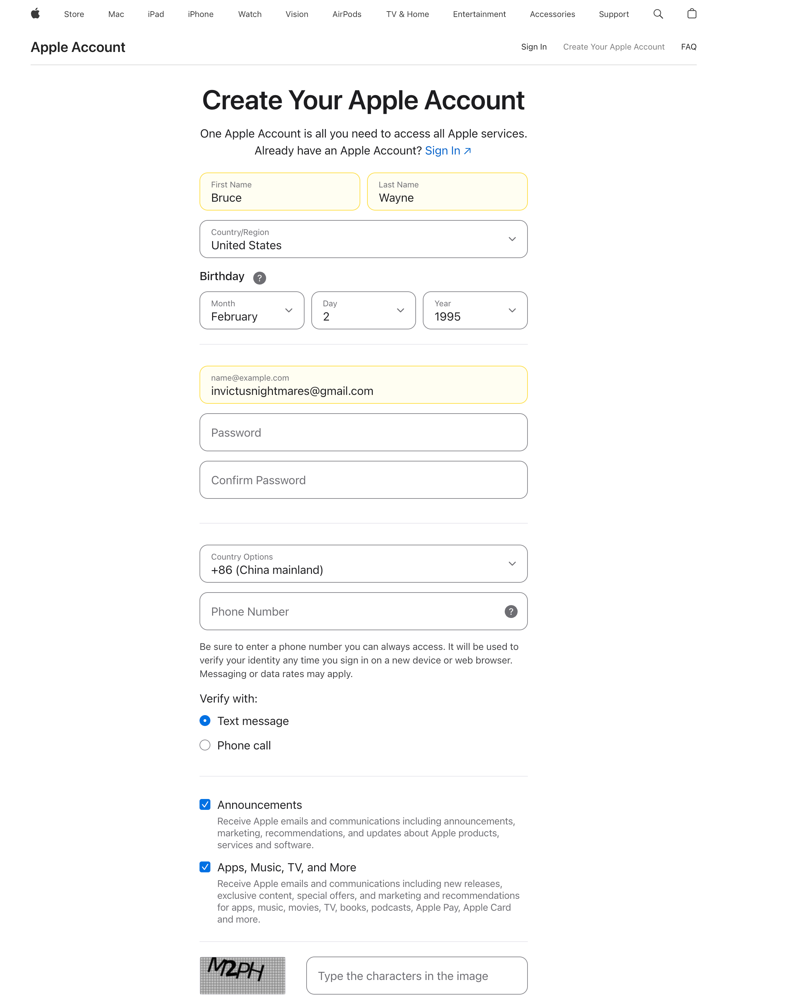
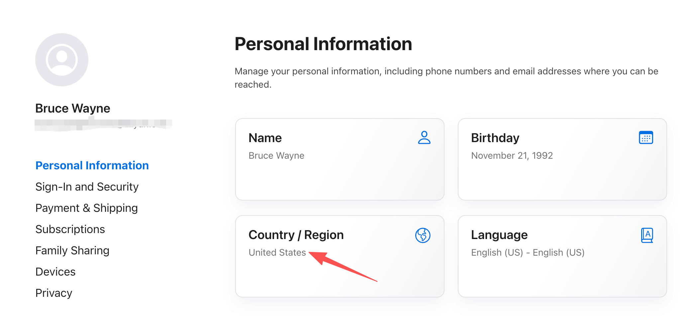
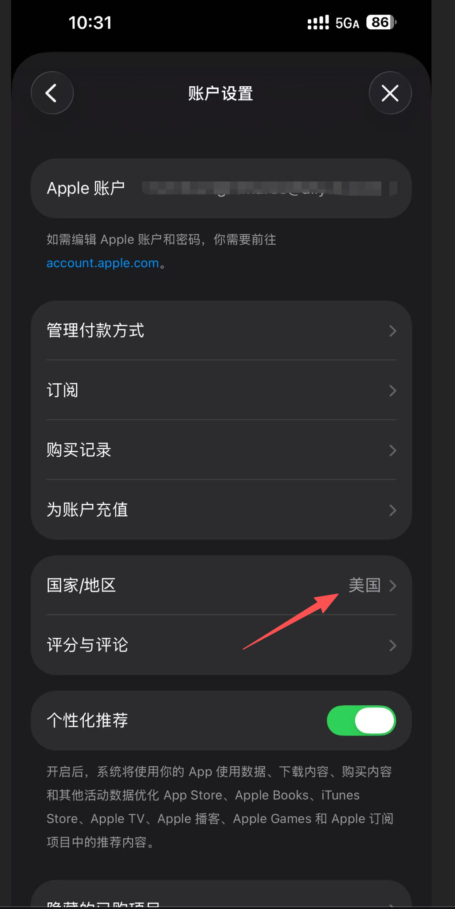

# 美区Apple ID注册及ChatGPT会员购买教程

## 目录
- [前言](#前言)
- [第一部分：注册美区Apple ID](#第一部分注册美区-apple-id)
- [第二部分：购买美区礼品卡](#第二部分购买美区礼品卡)
- [第三部分：兑换礼品卡并订阅ChatGPT](#第三部分兑换礼品卡并订阅-chatgpt)
- [常见问题](#常见问题)

---

## 前言

由于ChatGPT订阅在某些地区无法直接购买，通过美区Apple ID使用礼品卡支付是一种有效的解决方案。本教程将详细介绍完整流程。

### 准备工作
- 一个未注册过Apple ID的邮箱
- 能接收短信的手机号（中国大陆即可）

---

## 第一部分：注册美区Apple ID

### 通过官网注册

#### 步骤1：访问Apple ID注册页面
1. 打开浏览器，访问：https://appleid.apple.com/account
2. 页面会根据你的IP自动选择地区，如需切换到美区，可使用美国IP或手动选择

#### 步骤2：填写注册信息
1. **姓名**：填写真实或虚构的英文名
2. **国家/地区**：选择 **United States（美国）**
3. **出生日期**：填写一个年满18岁的日期
4. **邮箱**：使用你的邮箱作为Apple ID
5. **手机号**：选择中国区号 +86，填写能接收短信的手机号（注意：这个手机号需要没有注册过Apple ID）



#### 步骤3：验证信息
1. 输入发送到邮箱的验证码
2. 输入发送到手机的验证码
3. 点击"继续"完成注册



#### 步骤4: 手机App Store填写账号最终信息
1. 手机上打开App Store并退出当前账户，注意这里是只退出App Store的当前账户
2. 这一步非常关键，必须先让App Store切换到美区，才能登录账号，否则登录完成之后还是大陆账号，切换的办法就是iPhone自带的safari浏览器输入[`itms-apps://itunes.apple.com/WebObjects/MZStore.woa/wa/resetAndRedirect?dsf=143441&cc=us`](itms-apps://itunes.apple.com/WebObjects/MZStore.woa/wa/resetAndRedirect?dsf=143441&cc=us)，这个链接会自动跳转到App Store，然后确保打开的App Store打开的页面是英文的
3. 切换成功之后再登录之前网页注册的Apple ID，这时候就会发现成功注册了美区Apple ID

#### 步骤5: 填写美国地址

付款方式里面需要填写美国地址，可通过以下方式获取：

1. **使用免税州地址**（推荐，节省税费）
   - Oregon（俄勒冈州）、Delaware（特拉华州）、New Hampshire（新罕布什尔州）
   
2. **生成地址网站**：
   - https://www.fakeaddressgenerator.com/World/US_address_generator
   - 或搜索"美国虚拟地址生成器"

3. **示例地址**：
   ```
   街道：123 Main Street, Apt 4B
   城市：Portland
   州：Oregon
   邮编：97201
   电话：503-123-4567
   ```

   

---

## 第二部分：购买美区礼品卡

### 方式一：官方渠道（推荐）

#### Apple官网购买
1. 访问：https://www.apple.com/shop/buy-giftcard/giftcard
2. 选择金额（ChatGPT Plus订阅为$20/月）
3. 选择"通过邮件发送"
4. 填写收件邮箱（你的邮箱）
5. 使用支持国际支付的信用卡完成支付

### 方式二：第三方平台购买

#### 国内平台（适合无国际信用卡用户）

**平台1：某宝/闲鱼**
- 搜索"美区Apple礼品卡"
- 选择信誉高的商家
- 价格约为面值的1:1.1-1.2倍（含手续费）
- 注意：有风险，需谨慎

**平台2：专业充值网站**
- https://www.offgamers.com
- https://www.seagm.com
- 支持支付宝/微信支付
- 价格略高于面值

### 方式三：数字卡密网站

#### 推荐网站
1. **Amazon美国**
   - 购买数字礼品卡
   - 即时发送到邮箱
   - 需要美区Amazon账号

2. **Best Buy**
   - https://www.bestbuy.com/site/apple-apple-gift-card-apple/6421917.p
   - 支持数字版，邮件发送

### 注意事项
- 建议购买 **$20 或 $25** 面值（ChatGPT Plus订阅费为$19.99/月）
- 保留购买凭证和兑换码截图
- 首次充值建议小额测试

---

## 第三部分：兑换礼品卡并订阅ChatGPT

### 步骤1：兑换礼品卡

#### 方法A：通过App Store兑换
1. 打开 **App Store**
2. 点击右上角头像
3. 选择"兑换礼品卡或代码"
4. 使用相机扫描或手动输入兑换码
5. 等待充值成功，余额会显示在Apple ID下

#### 方法B：通过设置兑换
1. 打开 **设置** → **Apple ID**（顶部）
2. 点击 **媒体与购买项目**
3. 选择"兑换礼品卡"
4. 输入兑换码

#### 方法C：通过链接兑换
1. 如果收到礼品卡邮件，点击邮件中的"Redeem"按钮
2. 自动跳转并填充兑换码
3. 确认兑换

### 步骤2：下载并订阅ChatGPT

#### 下载ChatGPT应用
1. 在美区App Store搜索"ChatGPT"
2. 下载官方应用（开发者：OpenAI）
3. 打开应用并登录你的ChatGPT账号

#### 订阅ChatGPT Plus
1. 打开ChatGPT应用
2. 点击左下角或右下角的菜单
3. 选择"Upgrade to Plus"或"订阅ChatGPT Plus"
4. 确认价格为 **$20/月**
5. 使用Apple ID余额支付
6. 确认订阅

---

## 常见问题

### Q1：注册时提示"此Apple ID不可用"？
**原因**：邮箱已被注册或手机号绑定了过多账号  
**解决**：
- 更换新的邮箱地址
- 使用其他手机号

### Q2：无法选择"无"作为付款方式？
**原因**：Apple检测到你的IP或设备不在美国  
**解决**：
- 使用美国IP（可尝试切换网络环境）
- 或在注册后通过网页版Apple ID管理页面移除付款方式

### Q3：礼品卡兑换失败？
**可能原因**：
- 礼品卡已被使用
- 礼品卡区域不匹配（必须是美区卡）
- 账号异常

**解决方法**：
- 联系卖家核实
- 联系Apple客服
- 确保礼品卡是美区

### Q4：订阅时显示价格不是$20？
**原因**：含税费，不同州税率不同  
**解决**：
- 使用免税州地址（Oregon等）重新注册
- 或充值更多金额覆盖税费

### Q5：如何管理订阅？
1. 打开 **设置** → **Apple ID**
2. 点击 **订阅**
3. 找到ChatGPT，可取消或管理订阅

### Q6：订阅后可以在其他设备使用吗？
**可以**。ChatGPT Plus订阅与账号绑定，在任何设备登录同一ChatGPT账号都可享受会员权益。

### Q7：如何续费？
- 确保Apple ID余额充足（$20+）
- 订阅会自动续费
- 或提前充值礼品卡

### Q8：账号会被封吗？
**风险提示**：
- 使用美区Apple ID订阅ChatGPT存在一定风险
- 建议使用真实有效的信息注册
- 不要频繁切换账号或IP
- 保留所有购买凭证

---

## 补充说明

### 免税州地址参考

**Oregon（俄勒冈州）**
```
地址：123 NW Everett St
城市：Portland
州：Oregon (OR)
邮编：97209
电话：503-555-1234
```

**Delaware（特拉华州）**
```
地址：456 Market Street
城市：Wilmington
州：Delaware (DE)
邮编：19801
电话：302-555-5678
```

### 费用明细
| 项目 | 金额 |
|------|------|
| ChatGPT Plus订阅费 | $20/月 |
| App Store税费（非免税州） | 约$1-3/月 |
| 礼品卡（建议） | $20-25 |

---